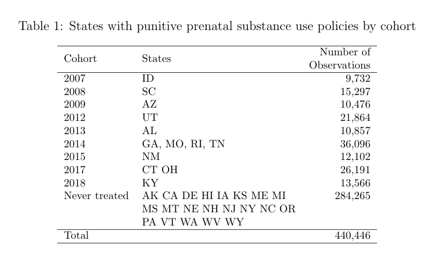
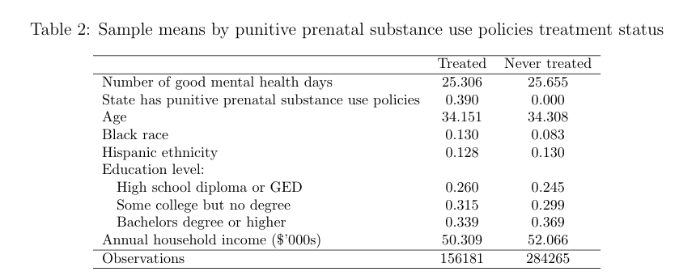

# deb & wool

An attempt at recreating the dataset used in the empirical example of section
5.2 in [Deb et. al. 2024](https://www.nber.org/papers/w33026).

## installation

```bash
uv venv
.venv/bin/activate
uv pip install --requirement requirements.txt
```

and then

```bash
make
```

**NOTE:** running the make command will download many large files.
Send me an e-mail for the final processed file.

## overview

- [Makefile](Makefile)
  - [collect.sh](collect.sh): Downloads BRFSS dataset zip files
  - [unzip.sh](unzip.sh): Unzips downloaded BRFSS dataset files
  - [construct.sh](construct.sh): Constructs Python cleaning scripts using
    scripts of
    [winstonlarson](https://github.com/winstonlarson/brfss/tree/master)
  - [proc.sh]( proc.sh): Executes all the generated yearly cleaning scripts to
    process the BRFSS data
  - [combine.py](combine.py) & [wool.py](wool.py) constructs final dataset

## Final data

- final dataset saved inside [wool.py](wool.py)
- see codes [here](https://www.cdc.gov/brfss/annual_data/annual_2018.html)
- [overview](final.txt)

```bash
┌─────────┬───────────────┬───────────┬───────────┬─────────┬───────────────┬────────┐
│ treated ┆ mental_health ┆ pm_health ┆ HS or GED ┆ Some    ┆ Bachelors or  ┆ #obs   │
│ ---     ┆ ---           ┆ ---       ┆ ---       ┆ college ┆ more          ┆ ---    │
│ bool    ┆ f64           ┆ f64       ┆ f64       ┆ ---     ┆ ---           ┆ u32    │
│         ┆               ┆           ┆           ┆ f64     ┆ f64           ┆        │
╞═════════╪═══════════════╪═══════════╪═══════════╪═════════╪═══════════════╪════════╡
│ false   ┆ 53.72383      ┆ 56.877551 ┆ 0.267     ┆ 0.311   ┆ 0.333         ┆ 102998 │
│ true    ┆ 53.912124     ┆ 56.977571 ┆ 0.249     ┆ 0.302   ┆ 0.36          ┆ 293060 │
└─────────┴───────────────┴───────────┴───────────┴─────────┴───────────────┴────────┘
```

### Tables in appendix




## credits

- Used scripts of
  [winstonlarson](https://github.com/winstonlarson/brfss/tree/master) as basis
